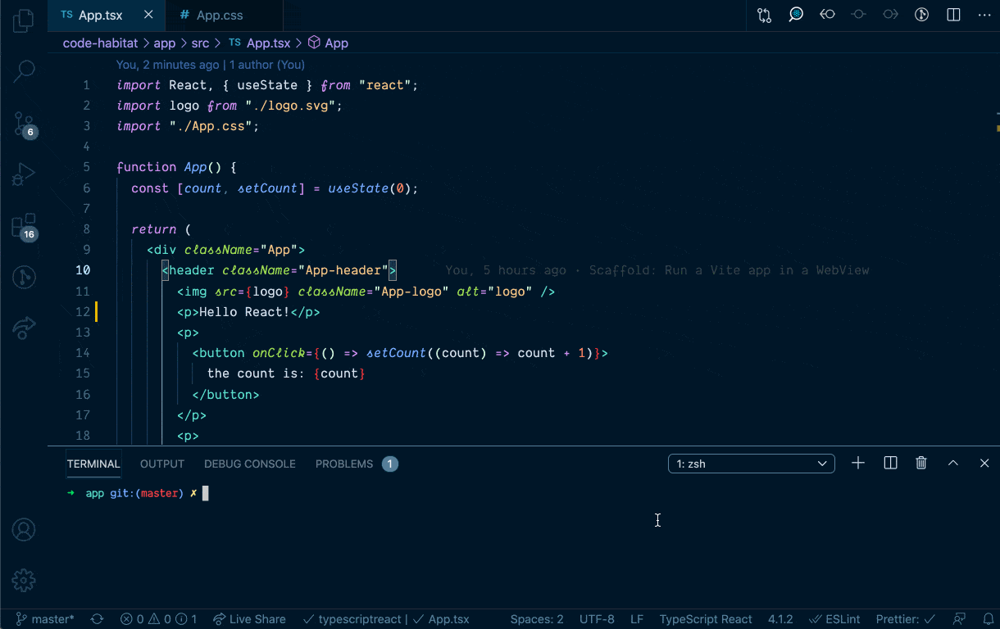

<p align="center"></p>
<h1 align="center">VS Code Live Frame</h1>
<p align="center">
<strong>Run your web application <i>inside</i> VS Code.</strong>
<br><br>

## Why would you want to do that?

You're developing a web application, and you've got some kind of a live/hot reloading setup. Instead of switching between your editor and a browser, with **Live Frame** you can see your changes without leaving VS Code.

Or, perhaps, you're streaming or recording a screen cast, and you just want everything nicely in one window. Whatever your reasons, we're not here to judge.



## How to use it

1. Install **Live Frame** from the [VS Code Marketplace](https://marketplace.visualstudio.com/items?itemName=jevakallio.vscode-live-frame).
2. Start your local development server
3. Run (`Cmd`+`Shift`+`P`) command `Live Frame: Open`
4. Follow the displayed [configuration instructions](#extension-settings).

### Extension Settings

Add the following to your User or Workspace settings. Given that your app's development URL is probably project specific, Workspace settings may make more sense.

```js
{
  // Required: The website to display
  "liveFrame.url": "http://localhost:3000",

  // Optional: Title for the pane tab heading
  "liveFrame.title": "Local Development",

  // Optional: Which pane to open the frame in
  "liveFrame.pane": "Beside"
}
```

If you have a fast hot reloading setup, you can turn on VS Code's **Auto Save** on a short delay when you need an extra blazing feedback loop.

```js
{
  "files.autoSave": "afterDelay",
  "files.autoSaveDelay": 50,
}
```

## Known Limitations

Because of the way **Live Frame** renders your site in an iframe-inside-webview, there are a couple of limitations.

### Your site needs to be able to run in an iframe

If your website prevents itself being loaded in an iframe e.g. via `X-Frame-Options` or `Content-Security-Policy`, it won't work inside Live Frame.

This should not be an issue for most development setups, but if it is, try [VSCode Browser Preview](https://marketplace.visualstudio.com/items?itemName=auchenberg.vscode-browser-preview) instead.

### Dev tools work, but element selector doesn't

You can open dev tools by running (`Cmd`+`Shift`+`P`) the `Open WebView Developer Tools` command. However, the point and click element selector doesn't select element inside the iframe.

### Command key combinations (Copy, Paste, Select all...) are disabled

This is a [known issue](https://github.com/microsoft/vscode/issues/65452) in VS Code.

As a workaround, you can send your keystrokes to the extension using `postMessage`, and we'll forward them to VS Code for you. Just add the following somewhere in your application code:

```js
if (window.parent !== window) {
  // If using TypeScript, next line should be:
  // let listener = (e: KeyboardEvent) =>
  let listener = (e) =>
    window.parent.postMessage(
      JSON.stringify({
        altKey: e.altKey,
        code: e.code,
        ctrlKey: e.ctrlKey,
        isComposing: e.isComposing,
        key: e.key,
        location: e.location,
        metaKey: e.metaKey,
        repeat: e.repeat,
        shiftKey: e.shiftKey,
      }),
      "*"
    );

  if (!window.hasOwnProperty("keyhookInstalled")) {
    // If using TypeScript, next line should be:
    // (window as any).keyhookInstalled = true;
    window.keyhookInstalled = true;
    window.addEventListener("keydown", listener);
  }
}
```

If you can think of a better solution (to fix the keyboard issue, or that doesn't involve using an iframe at all), see [Contributing](#contributing).

## Infrequently Asked Questions

### Which bundlers, dev servers etc. does Live Frame support?

All of them. Livereload, webpack, vite, servor, whatever angular people use... shouldn't matter. If yours doesn't work, double check it's not your own fault, and [open an issue](https://github.com/jevakallio/vscode-live-frame/issues/new).

### Wait, didn't this exist before?

Sort of. [Browser Preview](https://marketplace.visualstudio.com/items?itemName=auchenberg.vscode-browser-preview) embeds a headless Chrome, which is awesome, but also very resource intensive and kept crashing my VS Code. Then there are about a dozen extensions that live reload HTML in various ways, but if you're working with a web application with a build step, they're no use.

**Live Frame** takes a simple but lightweight route and uses a VS Code Webview pane, and inside it renders your app in a full-screen `iframe`. You can see the full implementation in [extension.ts](src/extension.ts).

### So is this exactly like a regular Chrome environment?

Not really. It's an embedded Electron webview with [known limitations](#known-limitations), and I'm sure many other minor differences to a full browser.

Use at your own peril during development, not for acceptance testing!

## Release Notes

### 0.1.1

Add workaround for keyboard binding issue.

### 0.1.0

Initial release.

## Contributing

Pull requests are welcome! For anything that significantly grows the scope of this project or complicates its maintenance, please open an issue to discuss first.

### Local development

Install dependencies with `yarn`, and run the project with `Run > Start Debugging` from within VS Code.

## License

[MIT](LICENSE)
