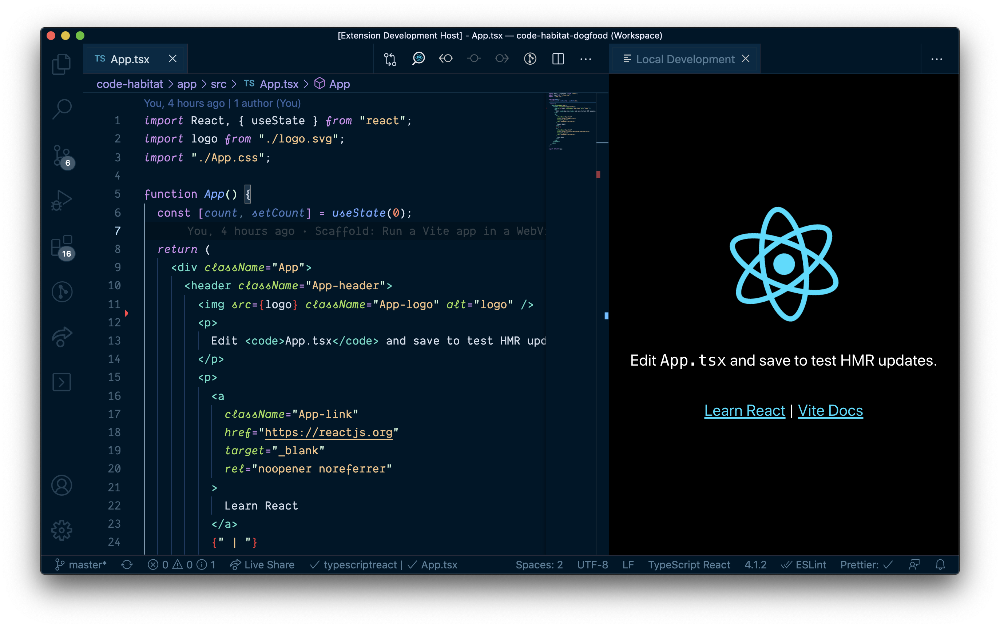

# VS Code Live Frame

_Run your web application inside VS Code._

## Use Case

You're developing a web application. Instead of switching between your editor and the running app, you can render your web application inside VS Code using **Live Frame**.



As long as you've got some kind of live/hot reloading setup (livereload, webpack, vite, servor... doesn't matter which), the site reloads like in a regular browser.

## How to use it

1. Install **Live Frame** from the VS Code Marketplace.
2. Start your local development server
3. Run (`Cmd`+`Shift`+`P`) command `Live Frame: Open`
4. Follow [configuration instructions](#extension-settings).

### Extension Settings

Add the following to your User or Workspace settings. Given that your app's development URL is probably project specific, Workspace settings may make more sense.

```js
{
  // Required: The website to display
  "liveFrame.url": "http://localhost:3000",

  // Optional: Title for the pane tab heading
  "liveFrame.title": "Local Development",

  // Optional: Which pane to open the frame in
  "liveFrame.pane": "Beside"
}
```

## Questions

### Can I use browser dev tools?

Yes, run (`Cmd`+`Shift`+`P`) the `Open WebView Developer Tools` command.

### Wait, didn't this exist before?

Sort of. [Browser Preview](https://marketplace.visualstudio.com/items?itemName=auchenberg.vscode-browser-preview) embeds a headless Chrome, which is awesome, but also very resource intensive and kept crashing my VS Code.

Then there are about a dozen extensions that live reload HTML in various ways, but let's face it, you have your own HMR setup already.

**Live Frame** takes a simple but lightweight route and uses a VS Code Webview pane, and inside it renders your app in a full-screen `iframe`. You can see the full implementation in [extension.ts](src/extension.ts).

### So is this exactly like a regular Chrome environment?

Not really. It's an embedded Electron webview, and I'm sure there are many minor differences to a full browser. Use at your own peril during development, not for acceptance testing!

### What if my website doesn't work in an iframe?

**If your website prevents itself being loaded in an iframe e.g. via `X-Frame-Options` or `Content-Security-Policy`, it won't work inside Live Frame.**

In that case, try [VSCode Browser Preview](https://marketplace.visualstudio.com/items?itemName=auchenberg.vscode-browser-preview) instead.

## Release Notes

### 0.1.0

Initial release.

## License

MIT
